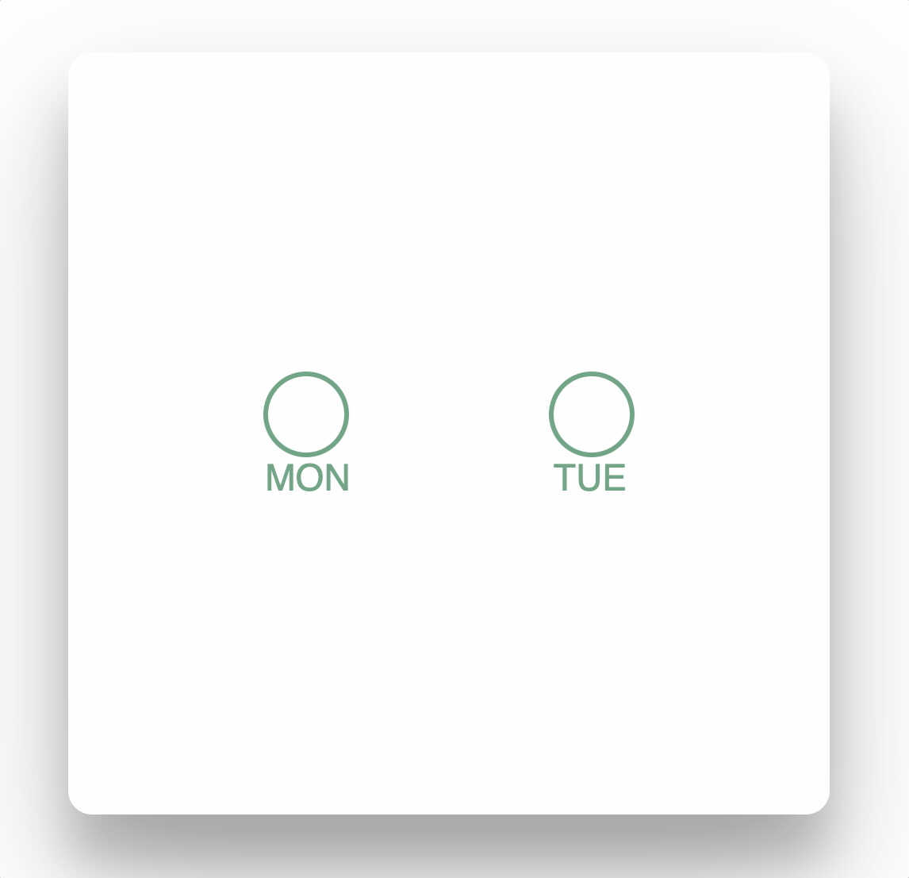

# react-animated_checkbox

> A customizable animated checkbox for React



[](https://www.npmjs.com/package/react-animated_checkbox) [](https://standardjs.com)

## Install

```bash
npm install --save @hriczzoli/react-animated_checkbox
```

## Usage

```jsx
import React, { Component } from 'react'

import {default as AnimatedCheckbox} from '@hriczzoli/react-animated_checkbox'

class Example extends Component {
  render () {
    return (
      <AnimatedCheckbox />
    )
  }
}
```

## Props

| Name | Type | Default | Description |
| --- | --- | --- | --- |
| id | string | test | plain text |
| name | string | NPM | plain text |
| value | node | 1 | anything that can be rendered: numbers, strings, elements or an arra (or fragment) containing these types |
| onChange | function |  | accepts a function - use e.g. to toggle isChecked state of the component
| disabled | bool | false | true/false to predetermine if checkbox should be checked when component is rendered
| fill | bool | false | true/false to select wether or not checkbox has a green background


```jsx
import React, { Component } from 'react'

import {default as AnimatedCheckbox} from '@hriczzoli/react-animated_checkbox'

class App extends Component {
  render () {
    return (
      <AnimatedCheckbox
        id="check"
        name="NPM"
        value={2}
        disabled={false}
        onChange={() => { this.setState({ isChecked:!this.state.isChecked })}}
      />
    )
  }
}

```


## License

MIT © [hriczzoli](https://github.com/hriczzoli)
